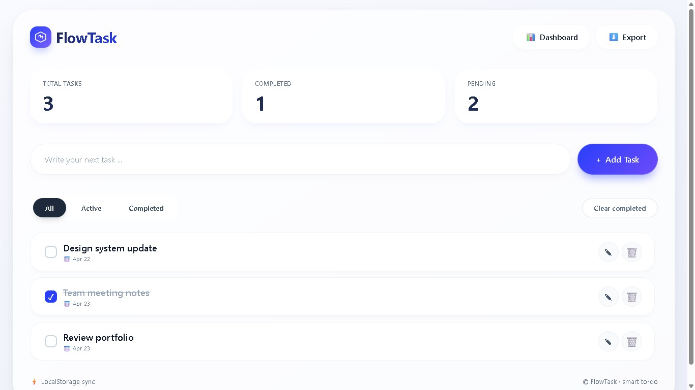
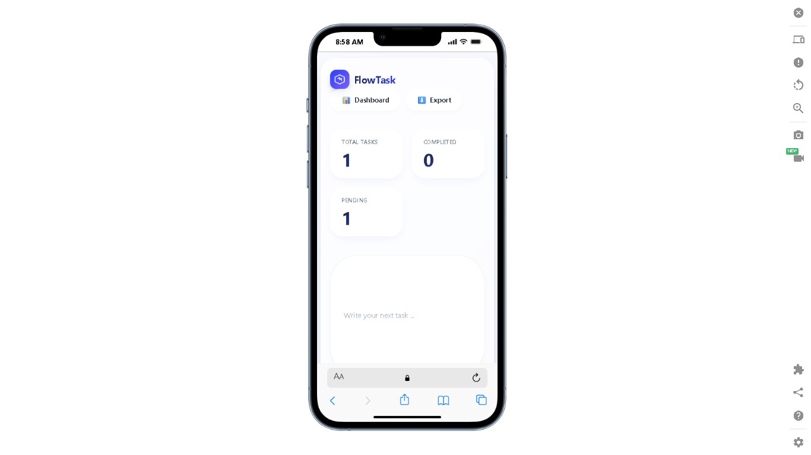

# 🎯 FlowTask — Advanced To-Do Application

A modern, fully responsive task management application built with **pure vanilla JavaScript** — no frameworks, no libraries, no dependencies.

---

## 📸 Preview

  
    
  

---

## 🚀 Live Demo

🔗 **[View Live Application](https://code-art-by-younas.github.io/FlowTask-Advanced-To-Do-Application/)**

---

## ✨ Key Features

| Feature | Description |
|---------|-------------|
| ✅ **CRUD Operations** | Create, Read, Update, Delete tasks seamlessly |
| 💾 **LocalStorage** | Data persists across browser sessions |
| 📊 **Live Dashboard** | Real-time stats: Total, Completed, Pending |
| 🔍 **Smart Filters** | Filter by All / Active / Completed |
| ✏️ **Inline Editing** | Edit tasks directly without modals or popups |
| 📱 **Fully Responsive** | Optimized for mobile, tablet, and desktop |
| 🎨 **Modern UI/UX** | Glassmorphism design with smooth animations |
| 📤 **JSON Export** | Download all tasks as backup file |
| ⚡ **Zero Dependencies** | 100% vanilla JavaScript |

---

## 🛠️ Technology Stack

| Technology | Usage |
|------------|-------|
| **HTML5** | Semantic structure, accessibility |
| **CSS3** | Flexbox, Grid, animations, glassmorphism, custom scrollbar |
| **JavaScript (ES6+)** | DOM manipulation, event delegation, arrow functions, template literals |
| **LocalStorage API** | Client-side data persistence |
| **GitHub Pages** | Free hosting & deployment |

---

